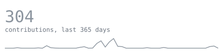
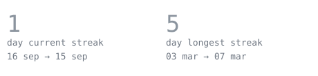
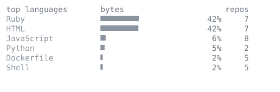

> Salesforce developer. Nine years as a product owner in fintech and 
> e-commerce before crossing over to code — I used to write the user 
> stories; now I write the Apex that closes them too.

<samp>Salesforce · Apex · LWC · Flow · JavaScript · React · SQL/SOQL · Python</samp>

<samp>Le Wagon web dev bootcamp, 2026 · starting a CS degree in 2027</samp>

